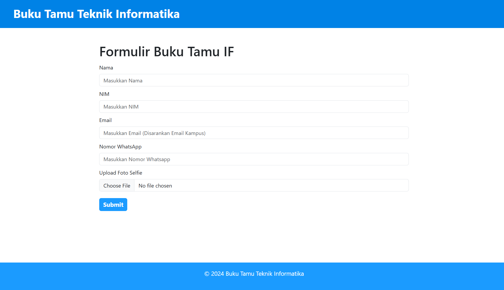

<div align="center">

[](#)

</div>

<h1 align="center">121140179-Ujian Akhir Semester</h1>

Ujian Akhir Semester mata kuliah Pemrograman Web (IF3028) Institut Teknologi Sumatera.

Tema: **Buku Tamu Prodi**

## Cara Instalasi & Penggunaan

### 1. Prasyarat
Pastikan Anda memiliki XAMPP atau sejenisnya dan Browser.

### 2. Instalasi
1. Clone repositori ini ke komputer Anda:  
   ```bash  
   git clone https://github.com/parhannn/uas-pemweb.git  
    ```
2. Masukkan folder ke htdocs XAMPP:  
   ```bash  
   XAMPP/htodcs/...
    ```
### 3. Menjalankan Program
1. Lakukan migrasi database dengan menggunakan browser, dan ketik:
   ```bash
   http://localhost/uas-pemweb/migration.php
   ```
2. Buka web:
   ```bash
   http://localhost/uas-pemweb/form.php
   ```

## Kelemahan Program

- Program belum memiliki fitur login untuk admin yang benar dengan login form, dan session login. Admin site bisa langsung diakses melalui tombol `Login Admin` pada home.

## Bagian 1: Client-side Programming (Bobot: 30%)

### 1.1 Manipulasi DOM dengan JavaScript (15%)

- Pada `form.php` terdapat formulir buku tamu yang dapat diisikan user tamu. Data yang diisikan yakni: nama, nim, email, whatsapp, dan foto selfie yang nantinya data akan muncul pada client-side pada `guest_list.php`:




- Dan juga pada `lecturer_list.php` terdapat juga formulir tambah dan edit data dosen. Dosen nantinya akan muncul pada `home.php` pada guest-side agar dapat dilihat.


### 1.2 Event Handling (15%)

- Pada setiap form sudah ditambahkan event handling seperti validateForm() sehingga sistem akan melakukan validasi terlebih dahulu sebelum mengirimkan data, berikut salah satu kutipan code pada `form.php`:

```HTML
<script>
        function validateForm() {
            const name = document.getElementById("name").value.trim();
            const nim = document.getElementById("nim").value.trim();
            const email = document.getElementById("email").value.trim();
            const whatsapp = document.getElementById("whatsapp").value.trim();
            const fileInput = document.getElementById("photo");
            const file = fileInput.files[0];

            if (name.length < 3) {
                alert("Nama harus terdiri dari minimal 3 karakter.");
                return false;
            }

            if (nim.length !== 9 || isNaN(nim)) {
                alert("NIM harus berupa 9 digit angka.");
                return false;
            }

            const emailRegex = /^[^\s@]+@[^\s@]+\.[^\s@]+$/;
            if (!emailRegex.test(email)) {
                alert("Email tidak valid.");
                return false;
            }

            const whatsappRegex = /^[0-9]{10,13}$/;
            if (!whatsappRegex.test(whatsapp)) {
                alert("Nomor WhatsApp tidak valid. Gunakan 10-13 digit angka.");
                return false;
            }

            if (!file) {
                alert("Unggah foto selfie Anda.");
                return false;
            }

            const allowedExtensions = ["png", "jpeg", "jpg"];
            const fileExtension = file.name.split(".").pop().toLowerCase();
            if (!allowedExtensions.includes(fileExtension)) {
                alert("Format foto harus berupa PNG, JPEG, atau JPG.");
                return false;
            }

            if (file.size > 2 * 1024 * 1024) {
                alert("Ukuran foto tidak boleh lebih dari 2MB.");
                return false;
            }

            return true;
        }
    </script>
```

## Bagian 2: Server-side Programming (Bobot: 30%)

### 2.1 Pengelolaan Data dengan PHP (20%)

- Pada `home.php`, `guest_list.php`, dan `lecturer_list.php` terdapat pengelolaan data dengan PHP menggunakan method **POST** dan **GET** yang akan tersimpan ke *database*. Pada home menggunakan method **GET** untuk mendapatkan list dosen, pada daftar tamu menggunakan method **GET** untuk mendapatkan daftar tamu yang mengisi formulir, dan pada daftar dosen menggunakan method **POST** dan **GET** untuk memungkinkan **CRUD** pada data dosen supaya data dosen bisa dibuat, baca, ubah, dan hapus.


### 2.2 Objek PHP Berbasis OOP (10%)

- Web ini menggunakan PHP Berbasis OOP untuk meng-*handle* Controller dan Connection. Terdapat 3 kelas yakni, `AdminController`, `GuestController`, dan `Connection`:

```PHP
<?php
    require_once 'includes/Connection.php';

    class AdminController extends Connection {
        public function getGuest() {
            . . .
        }

        public function addLecturer($name, $nip, $email, $photo) {
            . . .
        }

        public function deleteLecturer($id) {
            . . .
        }

        public function editLecturer($id, $name, $nip, $email, $photo) {
            . . .
        }        
    }
?>

<?php
    require_once 'includes/Connection.php';

    class GuestController extends Connection {
        public function addGuest($name, $nim, $email, $whatsapp, $photo) {
            . . .
        }

        public function getLecturer() {
            . . .
        }

        private function setCookie($name, $value, $expire, $path = "/", $domain = "", $secure = false, $httpOnly = false) {
            . . .
        }

        public function getCookie($name) {
            . . .
        }

        public function deleteCookie($name, $path = "/", $domain = "") {
            . . .
        }

        public function getLastGuestFromCookie() {
            . . .
        }
    }
?>

<?php
class Connection {
    private $host = 'localhost';
    private $username = 'root';
    private $password = '';
    private $database = 'buku_tamu_prodi';
    private $connect;

    public function __construct() 
    {
        . . .
    }

    public function getConnection() 
    {
        . . .
    }
}
?>
```

## Bagian 3: Database Management (Bobot: 20%)

### 3.1 Pembuatan Tabel Database (5%)

- Saya membuat `migration.php` untuk membuat database `buku_tamu_prodi` dan tabel-tabel yang dibutuhkan web ini.

```PHP
<?php
    $host = "localhost";
    $username = "root";
    $password = "";
    $database = "buku_tamu_prodi";
    
    $conn = new mysqli($host, $username, $password);
    
    if ($conn->connect_error) {
        die("Koneksi gagal: " . $conn->connect_error);
    }

    $sql_create_db = "CREATE DATABASE IF NOT EXISTS $database";
    if ($conn->query($sql_create_db) === TRUE) {
        echo "Database '$database' berhasil dibuat atau sudah ada.<br>";
    } else {
        die("Gagal membuat database: " . $conn->error);
    }

    $conn->select_db("buku_tamu_prodi");

    $sql_create_table_tamu = "
    CREATE TABLE IF NOT EXISTS tamu (
        id_tamu INT PRIMARY KEY AUTO_INCREMENT,
        tamu_nama VARCHAR(100) NOT NULL,
        tamu_nim VARCHAR(15) NOT NULL,
        tamu_email VARCHAR(100) NOT NULL,
        tamu_whatsapp VARCHAR(20) NOT NULL,
        tamu_foto VARCHAR(255) NOT NULL,
        created_at TIMESTAMP DEFAULT CURRENT_TIMESTAMP
    )
    ";

    if ($conn->query($sql_create_table_tamu) === TRUE) {
        echo "Table tamu created successfully.<br>";
    } else {
        echo "Error creating table tamu: " . $conn->error;
    }

    $sql_create_table_dosen = "
    CREATE TABLE IF NOT EXISTS dosen (
        id_dosen INT PRIMARY KEY AUTO_INCREMENT,
        dosen_nama VARCHAR(100) NOT NULL,
        dosen_nip VARCHAR(25) NOT NULL,
        dosen_email VARCHAR(100) NOT NULL,
        dosen_foto VARCHAR(255) NOT NULL,
        created_at TIMESTAMP DEFAULT CURRENT_TIMESTAMP
    )
    ";

    if ($conn->query($sql_create_table_dosen) === TRUE) {
        echo "Table dosen created successfully.<br>";
    } else {
        echo "Error creating table dosen: " . $conn->error;
    }

    $conn->close();
    echo "Migration completed";
?>
```

### 3.2 Konfigurasi Koneksi Database (5%)

- Saya juga membuat konfigurasi koneksi ke database `buku_tamu_prodi` dengan OOP.

```PHP
<?php
class Connection {
    private $host = 'localhost';
    private $username = 'root';
    private $password = '';
    private $database = 'buku_tamu_prodi';
    private $connect;

    public function __construct() 
    {
        $this->connect = new mysqli(
            $this->host, 
            $this->username, 
            $this->password, 
            $this->database
        );
            
        if ($this->connect->connect_error) {
            die('Connection failed: ' . $this->connect->connect_error);
        }
    }

    public function getConnection() 
    {
        return $this->connect;
    }
}
?>
```

### 3.3 Manipulasi Data pada Database (10%)

- Data yang ada di database bisa dimanimpulasi, saya tunjukan kutipan code saya untuk memanipulasi data dosen pada `AdminController.php`.

```PHP
<?php
    require_once 'includes/Connection.php';

    class AdminController extends Connection {
        public function getGuest() {
            $connection = $this->getConnection();
            $query = "SELECT * FROM tamu";
            $result = $connection->query($query);
            $guests = [];
            if ($result->num_rows > 0) {
                while ($row = $result->fetch_assoc()) {
                    $guests[] = $row;
                }
            }
            return $guests;
        }

        public function addLecturer($name, $nip, $email, $photo) {
            $connection = $this->getConnection();
            
            try {
                $target_dir = "images/";
                $photo_name = time() . "_" . basename($photo["name"]);
                $target_file = $target_dir . $photo_name;
                move_uploaded_file($photo["tmp_name"], $target_file);
                $query = "INSERT INTO dosen (dosen_nama, dosen_nip, dosen_email, dosen_foto, created_at) 
                          VALUES (?, ?, ?, ?, NOW())";
    
                $stmt = $connection->prepare($query);
                if ($stmt === false) {
                    throw new Exception("Error preparing query: " . $connection->error);
                }
    
                $stmt->bind_param("ssss", $name, $nip, $email, $photo_name);
    
                $result = $stmt->execute();
                $stmt->close();
    
                return $result;
            } catch (Exception $e) {
                echo "Error: " . $e->getMessage();
                return false;
            }
        }

        public function deleteLecturer($id) {
            $connection = $this->getConnection();
            $query = "DELETE FROM dosen WHERE id_dosen = ?";
            $stmt = $connection->prepare($query);
            if ($stmt === false) {
                throw new Exception("Error preparing query: " . $connection->error);
            }
            $stmt->bind_param("i", $id);
            $result = $stmt->execute();
            $stmt->close();
            return $result;
        }

        public function editLecturer($id, $name, $nip, $email, $photo) {
            $connection = $this->getConnection();
        
            $query = "SELECT dosen_foto FROM dosen WHERE id_dosen = ?";
            $stmt = $connection->prepare($query);
            if ($stmt === false) {
                throw new Exception("Error preparing query: " . $connection->error);
            }
            $stmt->bind_param("i", $id);
            $stmt->execute();
            $stmt->store_result();
            $stmt->bind_result($old_photo);
            $stmt->fetch();
            $stmt->close();
        
            if ($photo["name"]) {
                $target_dir = "images/";
                $photo_name = time() . "_" . basename($photo["name"]);
                $target_file = $target_dir . $photo_name;
                move_uploaded_file($photo["tmp_name"], $target_file);
                if (file_exists($target_dir . $old_photo)) {
                    unlink($target_dir . $old_photo);
                }
            } else {
                $photo_name = $old_photo;
            }
        
            $query = "UPDATE dosen SET dosen_nama = ?, dosen_nip = ?, dosen_email = ?, dosen_foto = ? WHERE id_dosen = ?";
            $stmt = $connection->prepare($query);
            if ($stmt === false) {
                throw new Exception("Error preparing query: " . $connection->error);
            }
            $stmt->bind_param("ssssi", $name, $nip, $email, $photo_name, $id);
            $result = $stmt->execute();
            $stmt->close();
            return $result;
        }        
    }
?>
```

## Bagian 4: State Management (Bobot: 20%)

### 4.1 State Management dengan Session (10%)

- Setiap view pada web ini telah diberikan `session_start()` pada skrip php di atas code html-nya, saya tampilkan beberapa kutipan code saya:

```PHP
<?php
    session_start();
    require_once 'controllers/AdminController.php';

    $adminController = new AdminController();
    $guests = $adminController->getGuest();
?>

<!DOCTYPE html>
<html lang="en">
<head>
    <meta charset="UTF-8">

    . . .

<?php
    session_start();

    require_once 'controllers/GuestController.php';

    $guestController = new GuestController();
    $lecturers = $guestController->getLecturer();

    $lastGuest = $guestController->getLastGuestFromCookie();
?>
<!DOCTYPE html>
<html lang="en">
<head>
    <meta charset="UTF-8">
    <meta name="viewport" content="width=device-width, initial-scale=1.0">
    <title>Buku Tamu Prodi IF | Home</title>
    <link rel="stylesheet" href="assets/css/global.css">

. . .
```

### 4.2 Pengelolaan State dengan Cookie dan Browser Storage (10%)

- Pada web ini disediakan fungsi untuk menetapkan, mendapatkan, dan menghapus cookie, berikut cuplikan code saya:

```PHP
<?php
    require_once 'includes/Connection.php';

    class GuestController extends Connection {
        public function addGuest($name, $nim, $email, $whatsapp, $photo) {
            . . .
        }

        public function getLecturer() {
            . . .
        }

        private function setCookie($name, $value, $expire, $path = "/", $domain = "", $secure = false, $httpOnly = false) {
            setcookie($name, $value, $expire, $path, $domain, $secure, $httpOnly);
        }

        public function getCookie($name) {
            return isset($_COOKIE[$name]) ? $_COOKIE[$name] : null;
        }

        public function deleteCookie($name, $path = "/", $domain = "") {
            setcookie($name, "", time() - 3600, $path, $domain);
        }

        public function getLastGuestFromCookie() {
            return $this->getCookie("last_guest");
        }
    }
?>
```

- Dan juga pada `question.php` saya menambahkan seperti formulir pesan, data nama dan pesan akan tersimpan ke local storage browser. Berikut cuplikan code javascript pada `question.php` saya:

```html
<script>
    function submitForm() {            
        const nama = document.getElementById("name").value;
        const pesan = document.getElementById("message").value;

        if (nama.length < 3) {
            alert("Nama harus terdiri dari minimal 3 karakter.");
            return;
        }

        if (pesan.length < 5) {
            alert("Pesan harus terdiri dari minimal 5 karakter.");
            return;
        }

        const questionData = {
            nama,
            pesan
        };

        let questionList = 
            JSON.parse(localStorage.getItem("questionList")) || [];
        questionList.push(questionData);
        localStorage.setItem("questionList", JSON.stringify(questionList));

        alert("Data berhasil disimpan ke localStorage.");
        
        document.getElementById("guestForm").reset();
    }
</script>
```
